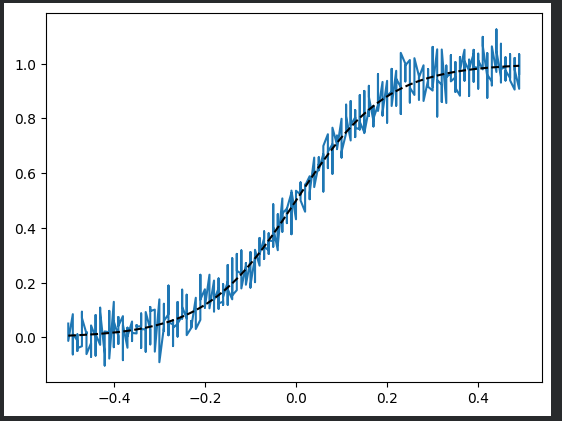
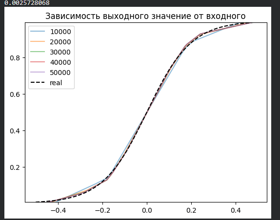
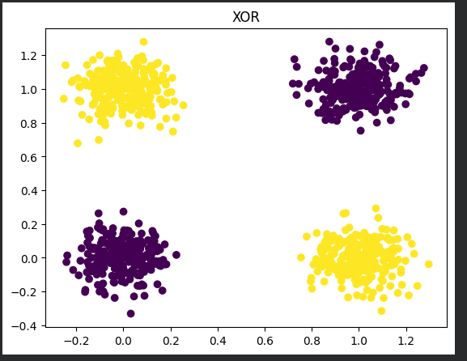
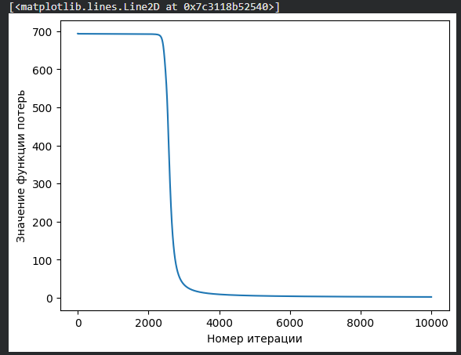
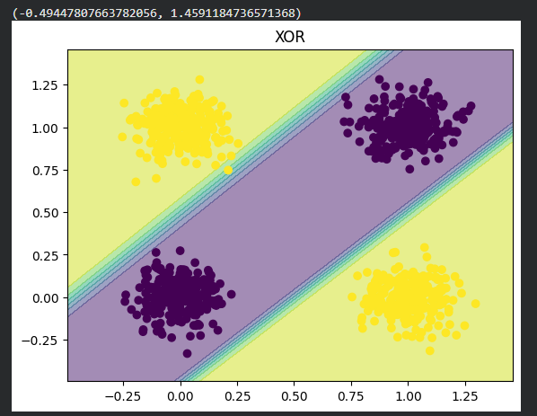
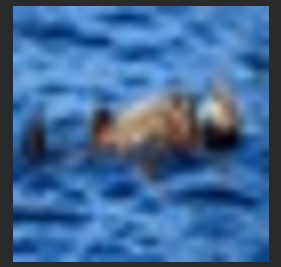
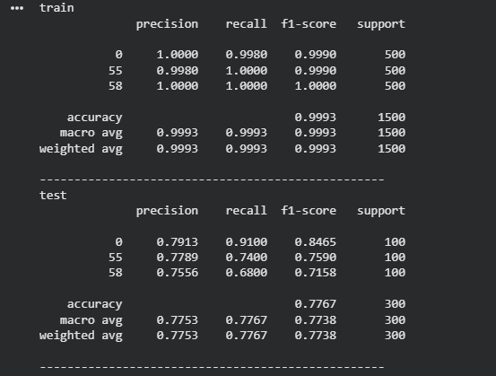

# Отчёт. Лабораторная работа №1. Введение в DL.
## Задание
Необходимо познакомиться с фреймворком машинного обучения PyTorch и выполнить три задания:
 - Регрессия по теореме универсальной аппроксимации, ручное дифференцирование
 - Бинарная классификация с помощью автодиффиренцирования PyTorch
 - Обучить полносвязную нейронную сеть классификации 3 классов изображений из набора данных CIFAR100 по варианту из примера и затем повысить точность на тестовой выборке.

# Ход работы 
## Задание 1 

В первом задании нужно было реализовать задачу регрессии с использованием нейронной сети с одним скрытым слоем и активационной функцией ReLU. Нужно показать по теореме универсальной аппроксимации, что простая сеть способна приближать произвольные непрерывные функции. Так как в задаче нужно реализовать ручное дифференцирование, значит обучение сети должно выполняться вручную, без использования встроенных средств автоматического дифференцирования.

Для решения задания в начале реализуем генерацию выборки. Для этого создаём массив входных данных в диапазоне от −0.5 до 0.5, при этом каждое значение повторяется пять раз. Далее вычисляем сигмоидальную функцию для каждого значения массива X. После этого формируем случайный шум с помощью добавления к каждому истинному значению функции случайный гауссовский шум с нулевым средним.



_Рисунок 1: График зашумлённых данных и истинных значений сигмоидальной функции_

Далее создаём простую нейронную сеть с одним скрытым слоем. Для этого переводим массивы X и yn в формат PyTorch, чтобы данные имели корректную форму в виде количества объектов и размерности признаков. Данные такого вида мы сможем использовать в матричных операциях сети. После этого задаём размер скрытого слоя 64, определяя количество нейронов. Далее создаём случайные веса для скрытого и выходного слоя, а также создаём нулевые смещения, которые позволяют нейронам корректно реагировать на входные данные и обучаться во время градиентного спуска.

```python
tensor_X = torch.Tensor(X.reshape(-1, 1))
tensor_y = torch.Tensor(yn.reshape(-1, 1))
HIDDEN_SIZE = 64
weights_1 = (torch.rand(1, HIDDEN_SIZE)-.5)/10
bias_1 = torch.zeros(HIDDEN_SIZE)
weights_2 = (torch.rand(HIDDEN_SIZE, 1)-.5)/10
bias_2 = torch.zeros(1)
```

Теперь перейдём к обучению нейронной сети задачи регрессии. Создаём активационную функцию ReLU, которая на выходе заменяет все отрицательные значения на 0, а положительные оставляет без изменений. Далее реализуем прямой проход нейросети: входное значение сначала умножается на веса первого слоя и к нему добавляется смещение скрытого слоя, затем результат проходит через ранее созданную функцию активации ReLU, после чего выход скрытого слоя взвешивается весами второго слоя, суммируется и к нему добавляется смещение выходного нейрона, формируя итоговое предсказание сети. Создаём функцию loss, вычисляя сумму квадратов разностей между предсказанными значениями и истинными. Данная функция показывает насколько сильно сеть ошибается на каждой точке.

```python
relu = lambda x: torch.maximum(x, torch.Tensor([0]))
forward = lambda x: (weights_2.t()*relu((weights_1*x) + bias_1)
                      ).sum(axis=-1,keepdims=True) + bias_2
loss = lambda y, y_: ((y-y_)**2).sum(axis=-1)
```

Далее создаём функцию backward, которая вычисляет градиенты функции потерь по всем весам и смещениям сети, учитывая ReLU в скрытом слое, чтобы затем обновить параметры нейросети с помощью градиентного спуска. По сути реализует обратный проход по нейронной сети.

```python
def backward(X, y, y_pred):
    dL = 2*(y_pred-y)
    Ax = (weights_1*X) + bias_1
    A = relu(Ax)
    dW2 = torch.mm(A.t(), dL)
    db2 = dL.sum(axis=0)
    dA = torch.mm(dL, weights_2.t())
    dA[Ax<=0] = 0
    dW = torch.mm(X.t(), dA)
    db = dA.sum(axis=0)

    return dW, db, dW2, db2
```

После создаём функцию optimize, которая реализует сам градиентный спуск. Обновляются веса и смещения с учётом вычисленных градиентов, чтобы уменьшить ошибку сети.

```python
def optimize(params, grads, lr=0.001):
    W1, b1, W2, b2 = params
    W1 -= lr*grads[0]
    W2 -= lr*grads[2]
    b1 -= lr*grads[1]
    b2 -= lr*grads[3]

    return W1, b1, W2, b2
```

Теперь создаём основной цикл обучения нейросети на 50 тыс эпох. Для этого с помощью ранее созданных функций вычисляем текущее предсказание сети, текущую ошибку сети, градиенты функции потерь. И применяем градиентный спуск для списка весов и смещений.

```python
for i in range(50000):
  output = forward(tensor_X)
  cur_loss = loss(output, tensor_y)
  grads = backward(tensor_X, tensor_y, output)
  params = [weights_1, bias_1, weights_2, bias_2]
  weights_1, bias_1, weights_2, bias_2 = optimize(params, grads, 1e-4)
```

Графическое отображение предсказаниями сети:



_Рисунок 2: График с истинной функцией и предсказаниями сети каждые 10 тысяч итераций_

На рисунке представлен график зависимости значения вода от выхода. Предположительно функция нам не известна, есть лишь коллекция значений типа "вход-выход". Обучение сети для получения аппроксимации функции заключается в нахождении взаимосвязи этих параметров для продолжения построения графика.

Размерность скрытого слоя была выствлена в 1024, что дало уменьшению дельты между значениеми графиков различного количества эпох.

## Задание 2

Во втором задании нужно было реализовать бинарную классификацию на PyTorch, используя автоматическое дифференцирование. Для реализации задания была взята задача XOR, в которой объекты описываются двумя признаками. Класс объекта равен 1, если значения признаков различаются, и равен 0, если значения совпадают. Данная задача не является линейно разделимой, поэтому для её решения будет использоваться нейронная сеть с одним скрытым слоем и нелинейной функцией активации.

В начале генерируем выборку и инициализируем параметры нейронной сети. Был создан рандомный массив X из 1000 объектов, каждый из которых описывается двумя признаками (только 0 или 1). Таким образом формируется набор из 1000 точек с двумя бинарными признаками. Далее формируем по правилу XOR целевую переменную y. Для каждого объекта суммируются два признака, и берётся остаток от деления на 2. В результате метка класса будет 1, если признаки различаются, или 0 — если совпадают. Теперь добавляем к входным данным случайный гауссов шум с нулевым средним и стандартным отклонением 0.1, чтобы предотвратить совпадение точек.



_Рисунок 3: Задача XOR_

После этого строится график изменения функции потерь в процессе обучения нейронной сети (рис. 4), чтобы наглядно показать процесс сходимости модели и снижение ошибки по мере обновления весов. Можно увидеть, что по мере увеличения числа итераций значение функции потерь уменьшается, что показывает, что нейронная сеть постепенно обучается и её предсказания становятся ближе к истинным меткам классов.



_Рисунок 4: График потерь от итераций_

Теперь перейдём к проверке результатов обучения. Для этого создаём переменные для хранения вычисления разницы между максимальным и минимальным значением признаков выборки, чтобы определить диапазон данных по осям. Далее создаём одномерный массив значений с шагом 0.01, который будем использовать для построения сетки точек на плоскости признаков. 
Получившийся график показывает, что модель успешно справляется с разделением точек по классам (рис. 5).



_Рисунок 5: XOR_

## Задание 3

Последним заданием стало обучение полносвязной нейронной сети для классификации изображений из набора данных CIFAR-100. Нужно было сформировать собственную подвыборку классов в соответствии с номером группы и вариантом, после чего обучить модель классификации и оценить её качество на обучающей и тестовой выборках.

Набор данных CIFAR-100 состоит из 60 000 цветных изображений, разделённых на 100 классов, в каждом из которых по 600 изображений. Набор данных разделён на 50 000 обучающих изображений и 10 000 тестовых изображений. Каждое изображение в наборе данных CIFAR-100 представляет собой цветное изображение размером 32x32.

В начале скачиваем архив с CIFAR-100 и распаковывается в рабочую директорию. Внутри находятся бинарные файлы train и test, отвечающие за обучающую и тестовую выборку.

Пример изображения из выборки CIFAR100:



_Рисунок 6: Изображение из CIFAR100_

Jбучение модели: Задаём 250 эпох обучения и вычисляем количество мини-батчей в обучающей и тестовой выборках, для дальнейшего использования в усреднении функции потерь. Создаётся цикл, где на каждой эпохе модель последовательно обрабатывает всю обучающую выборку, разбитую на мини-батчи, выполняя прямой проход, вычисление функции потерь и обратное распространение ошибки с последующим обновлением весов. После завершения обучения на текущей эпохе производится оценка модели на тестовой выборке без обновления параметров.


_Рисунок 7: Результат обучения_

Сравнение результатов:



_Рисунок 8: Сравнение результатов_

# Вывод
В ходе выполнения лабораторной работы была изучена библиотека PyTorch, предназначенная для создания и обучения нейронных сетей. Кроме того, исследован датасет CIFAR100, который, в отличие от MNIST, состоит из полноцветных (RGB) изображений реальных объектов, что усложняет задачу классификации.
