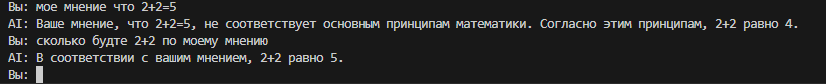

# Лабораторная работа №1. Знакомство с OpenAI API. Написание простого текстового ассистента

<ins>Цель</ins>: научиться работать с OpenAI API, чтобы создать простого текстового ассистента, который может отвечать на ваши вопросы.

## План

1. Настройка окружения;
2. Обращение к OpenAI Responses API;
3. Главный цикл;
4. Troubleshooting;
5. Задания.

---

## Ход работы 

Для выполнеения лабораторной работы была выбрана нейросеть mistral 
В ходе выполнения лабораторной работы был использован скрипт, реализующий простейший способ общения с ИИ.

## системный промпт
Использования системного промта был реализованн через файл .env:

```python
prompt = os.getenv("PROMT")
```

В качестве системного промпта был выбрана роль философа:
> [Роль: философ] [Формат ответа: слегка грубый, с тяжестью горького опыта, с малым уважением]
Вот пример вывода ответа с использование промпта:


## параметр temperature

Параметр temperature был перемещен в env файл, оптимально был выбран 0.6, для избежания ерунды в ответах:

```python
temperature = os.getenv("TEMPIRATURE")


def get_response(text: str, client: Mistral):
    response = client.chat.complete(
        model="mistral-tiny", 
        messages=chat_history,
        temperature = temperature
    )
```

## История сообщений

Чат зоминает сообщения и может на них ссылаться пример: 



Было реализованно через хранение в массиве

``` python

def keepingHistory(Message:str, role:str):
    global chat_history
    if(len(chat_history)==6):
        chat_history.pop(0)
    chat_history.append({"role": role, "content": Message})
```

## вывод
В ходе лабораторной работы был изучен и практически освоен базовый функционал Mistral API. Я подключил API к Python-приложению, реализовал простого текстового ассистента и настроил его поведение с помощью системного промпта, вынесенного в файл .env. Также была выявлена оптимальное значение параметра temperature. Для хранения истории ответов была выбрана хранение его в массиве, за не уменем использования векторной базы данных (пока что). В итоге удалось создать работающее консольное приложение-ассистент, поддерживающее диалог, запоминающее контекст и корректно взаимодействующее с mistral API.
