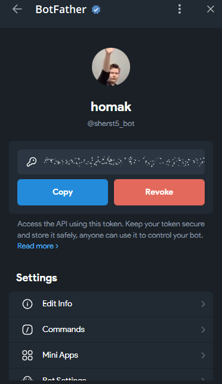

# Лабораторная работа №2: Простейший чат-бот в Telegram

## Цель работы

Цель лабораторной работы — получение навыков работы с библиотекой Aiogram, связка API OpenAI и написанного бота.

## План

1. Настройка окружения;
2. Написание основных функций бота;
3. Задания.

## Ход работы

для выполнения лабораторной работы был создан тг бог `homak` через BotFather в телеграмме 


также ключ был скопирован и добавлен в env файл


# задание 1
создание добавление системного промпта, был взят такой же как из прошлой лабораторной работы
<[Роль: философ] <[Формат ответа: слегка грубый, с тяжестью горького опыта, с малым уважением]


# задание 2
Добавив к промпту строку, получения имени пользователя, бот стал начинать диалог и обращаться, используя имя пользователя.
```python
{message.from_user.full_name}
```
# Задание 3 и 4
Для хранения истории сообщений использовалась СУБД PostgreSQL с применением ORM SQLAlchemy. 
Реализована функция сброса истории путём очистки таблицы messages. 
Методы взаимодействия с базой данных были реализованы в виде classmethod внутри моделей соответствующих таблиц.
# задание 5
Возможность реагировать на сообщения была реализована путем проверки содержимого сообщения:


# вывод
В ходе лабораторной работы исследованы принципы организации памяти нейросетевых моделей. Приобретены практические навыки разработки Telegram-бота с использованием фреймворка aiogram, интегрированного с базой данных PostgreSQL через ORM SQLAlchemy.

Для управления ботом реализованы команды /start (инициализация диалога) и /clear_history (очистка истории сообщений). Исходный код проекта размещён в директории ./programm.
