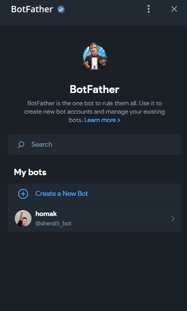
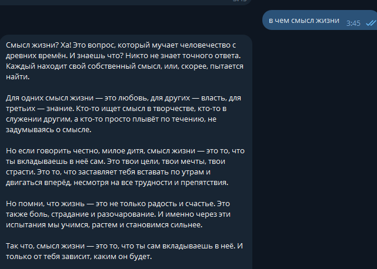
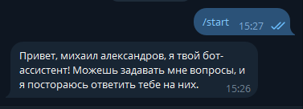
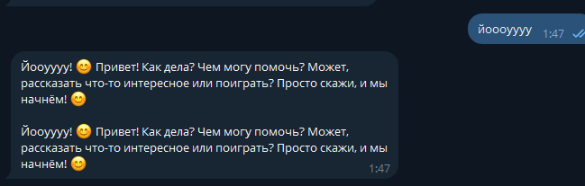

# Лабораторная работа №2: Простейший чат-бот в Telegram

## Цель работы

Цель лабораторной работы — получение навыков работы с библиотекой Aiogram, связка API OpenAI и написанного бота.

## План

1. Настройка окружения;
2. Написание основных функций бота;
3. Задания.

## Ход работы

Для выполнения лабораторной работы был создан тг бог `homak` через BotFather в телеграмме, а его ключ был помещен в .env файл:


Картинка 1: Окно BotFather

```python
TOKEN = os.getenv("BOT_TOKEN")
```

# Задание 1
Cоздание добавление системного промпта, был взят такой же как из прошлой лабораторной работы:

>[Роль: философ] [Формат ответа: слегка грубый, с тяжестью горького опыта, с малым уважением]


Картинка 2: Ответ ИИ с использование промпта

Системный промпт был также перемещен в файл .env.

# Задание 2
Добавив к промпту строку, получения имени пользователя, бот стал начинать диалог и обращаться, используя имя пользователя.
```python
{message.from_user.full_name}
```

Картинка 3: ответ ИИ с обращениек к пользователю

# Задание 3 и 4
Для хранения истории сообщений использовалась СУБД PostgreSQL с применением ORM SQLAlchemy. 
Реализована функция сброса истории путём очистки таблицы messages. 
Методы взаимодействия с базой данных были реализованы в виде classmethod внутри моделей соответствующих таблиц.

Модель пользоватея:
```python
from servis.model.database import Base
from sqlalchemy.orm import Mapped, mapped_column
from sqlalchemy import String, select
from servis.session import async_session

class UserBase(Base):
    __tablename__ = "user"

    id: Mapped[int] = mapped_column(primary_key=True)
    name: Mapped[str] = mapped_column(String(100))
    login: Mapped[str] = mapped_column(String(255), unique=True)

    @classmethod
    async def get_user(cls, tg_id: int):
        async with async_session() as session:
            result = await session.execute(
                select(cls).where(cls.login == str(tg_id))
            )
            return result.scalars().first()

    @classmethod
    async def get_or_create_user(cls, tg_id: int, username: str | None, full_name: str):
        async with async_session() as session:
            result = await session.execute(
                select(cls).where(cls.login == str(tg_id))
            )
            user = result.scalars().first()

            if not user:
                user = cls(
                    login=str(tg_id),
                    name=full_name or username or "Unknown"
                )
                session.add(user)
                await session.commit()
                await session.refresh(user)

            return user
```

Модель сообщений:
```python
from servis.model.database import Base
from sqlalchemy.orm import Mapped, mapped_column
from sqlalchemy import String, ForeignKey, Text, select, delete
from servis.session import async_session

class MessageBase(Base):
    __tablename__ = "messages"

    id: Mapped[int] = mapped_column(primary_key=True)
    message: Mapped[str] = mapped_column(Text)
    role: Mapped[str] = mapped_column(String(100))
    user_id: Mapped[int] = mapped_column(ForeignKey("user.id"))

    @classmethod
    async def get_messages_by_user_id(cls, user_id: int) -> list[dict]:
        async with async_session() as session:
            result = await session.execute(
                select(cls)
                .where(cls.user_id == user_id)
                .order_by(cls.id)
            )

            return [
                {"role": msg.role, "content": msg.message}
                for msg in result.scalars().all()
            ]
        
    @classmethod
    async def save_message(cls, user_id: int, role: str, content: str) -> None:
        async with async_session.begin() as session:
            session.add(
                cls(
                    user_id=user_id,
                    role=role,
                    message=content
                )
            )

    @classmethod
    async def delete_by_user_id(cls, user_id: int) -> None:
        async with async_session.begin() as session:
            await session.execute(
                delete(cls).where(cls.user_id == user_id)
            )
```

# Задание 5
Возможность реагировать на сообщения была реализована путем проверки содержимого сообщения:
```python
async def message_handler(message: Message) -> None:
    if message.text: 
        user = await UserBase.get_or_create_user(
            tg_id=message.from_user.id,
            username=message.from_user.username,
            full_name=message.from_user.full_name
        )

        try:
            response = await get_response(
                user_message=message.text,
                user_id=user.id,
                client_full_name=user.name
            )

            for part in split_message(response, MAX_TEXT_LENGTH):
                await message.answer(part, parse_mode=None)
                await MessageBase.save_message(user_id=user.id, role="assistant", content=part)

        except Exception as e:
            logging.error(f"Error in message_handler: {e}")
            await message.answer("Ошибка при обработке сообщения")
    else:
        await message.answer("Пожалуйста, отправляйте только текстовые сообщения.")

```


Картинка 4: Реакция ИИ на картинки

# вывод
В ходе лабораторной работы исследованы принципы организации памяти нейросетевых моделей. Приобретены практические навыки разработки Telegram-бота с использованием фреймворка aiogram, интегрированного с базой данных PostgreSQL через ORM SQLAlchemy.
Для управления ботом реализованы команды /start (инициализация диалога) и /clear_history (очистка истории сообщений). Исходный код проекта размещён в директории ./programm.
