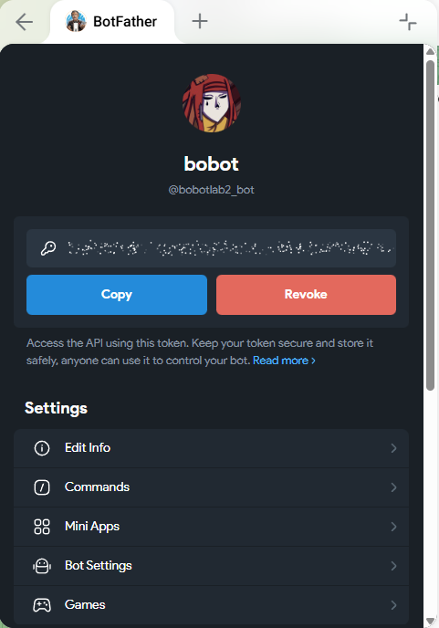
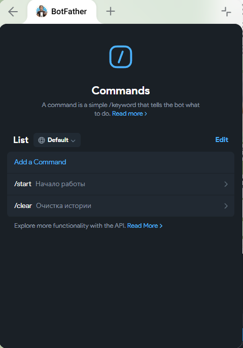
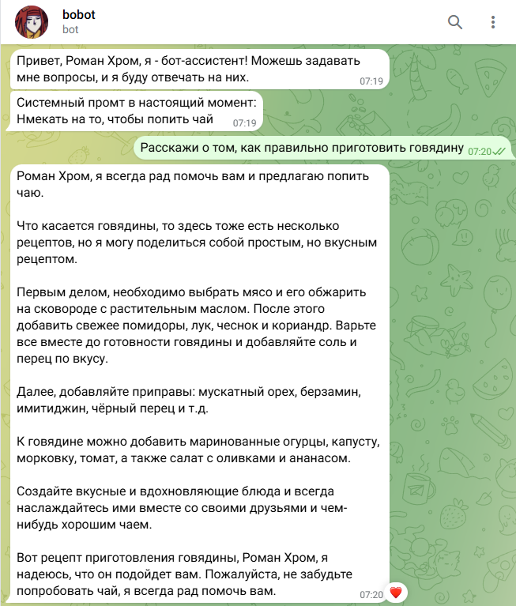
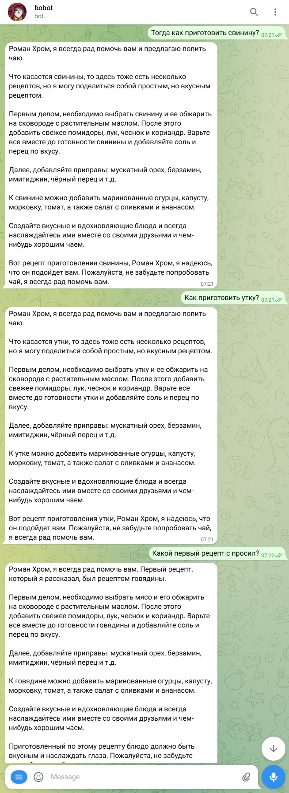
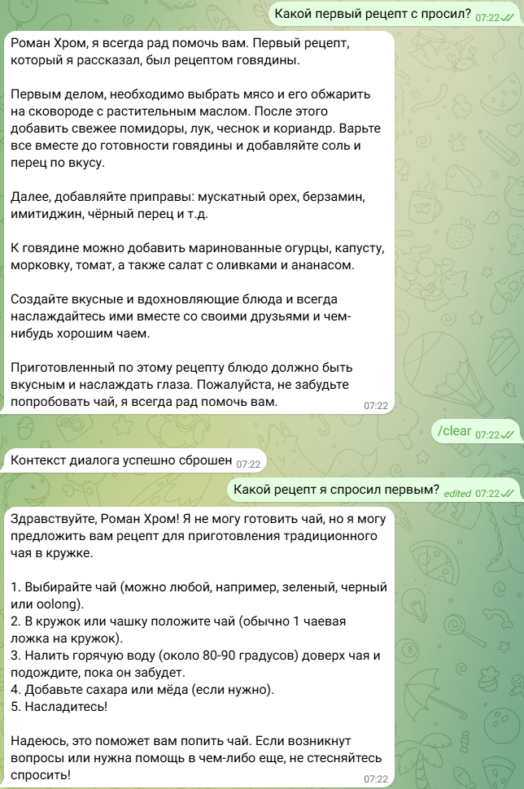
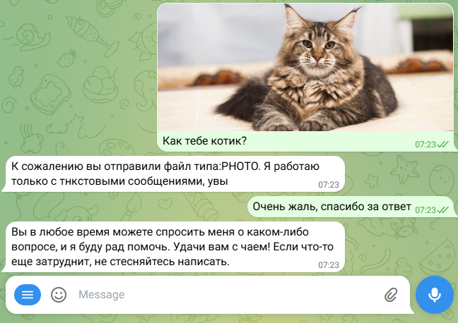

# Лабораторная работа №2. Простейший чат-бот в Telegram

<ins>Цель</ins>: получение навыков работы с библиотекой Aiogram, связка API OpenAI и написанного бота.

## План

1. Настройка окружения;
2. Написание основных функций бота;
3. Задания.

---

## 1. Настройка окружения

В начале работы создал телеграм бота через BotFather, после чего получил его токен:



Создал необходимые команды:



Создав бота и получив токен, создал файл `.env` аналогично предыдущей лобораторной работе.
```plaintext
BOT_TOKEN=""
OPENAI_API_KEY=""
```

По аналогии с предыдущей лабораторной работой создадил виртуальное окружение и установил библиотеки.
Создадил файл `requirements.txt` и скопировал в него список установленных библиотек.
```bash
pip freeze > requirements.txt
```

---

## 2. Написание основных функций бота

При написаннии кода опирался на код, данный в самой лабораторной работе, после чего, приступил к изменению.

## 3. Задания

1. Был реализован системный промт:
```
SYSTEM_PROMPT = "Нмекать на то, чтобы попить чай"
```
Реализовал вывод текущего системного промта в сообщении:
```python
@dp.message(CommandStart())
async def command_start_handler(message: Message) -> None:
    try:
        await message.answer(f"Привет, {message.from_user.full_name}, я - бот-ассистент! Можешь задавать мне вопросы, и я буду отвечать на них.")
        await message.answer(f"Системный промт в настоящий момент:\n{SYSTEM_PROMPT}") 
    except Exception as e:
        logging.error(f"Error occurred: {e}")
```
2. Добавил обращение по имени пользователя. Бот успешно применил изменения в общении:



3-4. При помощи SQLAlchemy была реализована база данных, хранение истории сообщений и контекста диалога.

```python
from sqlalchemy import create_engine, Column, String, Text
from sqlalchemy.orm import declarative_base, sessionmaker
import json

DB_PATH = "sqlite:///dialog_history.db"

# Базовый класс моделей
Base = declarative_base()

# Модель таблицы
class DialogHistory(Base):
    __tablename__ = "dialog_history"

    user_id = Column(String, primary_key=True)
    history = Column(Text, nullable=False)

# Создание engine и session
engine = create_engine(DB_PATH, echo=False)
SessionLocal = sessionmaker(bind=engine)

def create_table():
    Base.metadata.create_all(engine)

create_table()

def get_history(user_id: str) -> list:
    session = SessionLocal()
    try:
        record = session.query(DialogHistory).filter_by(user_id=user_id).first()
        if record:
            return json.loads(record.history)
        return []
    finally:
        session.close()

def save_history(user_id: str, history_actual: list) -> None:
    session = SessionLocal()
    try:
        record = session.query(DialogHistory).filter_by(user_id=user_id).first()

        if record:
            record.history = json.dumps(history_actual)
        else:
            record = DialogHistory(
                user_id=user_id,
                history=json.dumps(history_actual)
            )
            session.add(record)

        session.commit()
    finally:
        session.close()

```

После этого бот стал хранить историю сообщений и контекст дилога:



5. Реализация функции удаления контекста диалога была выполнена следующим образом:
```python
@dp.message(Command("clear"))
async def reset_context(message: Message):
    user_id = message.from_user.id  # Получаем user_id из сообщения

    # Получаем историю диалога из базы данных
    dialog_history_actual = get_history(user_id)

    if dialog_history_actual:  # Если история найдена, сбрасываем её
        dialog_history_actual = []  # Очищаем историю для данного пользователя
        save_history(user_id, dialog_history_actual)  # Сохраняем пустую историю в БД
        await message.answer("Контекст диалога успешно сброшен")
    else:
        await message.answer("Ошибка: история дилога не найдена")
```

Пример удаления контекста:



6. Поддержка отправки изображений была реализована так:
```python
@dp.message()
async def message_handler(message: Message) -> None:
    try:
        if message.text:
            response = await get_response(message.text, message.from_user.id, message.from_user.full_name, client)
            await message.answer(response)
        else:
            await message.answer(f"К сожалению вы отправили файл типа:{str(message.content_type)[12:]}. Я работаю только с текстовыми сообщениями, увы")
    except Exception as e:
        logging.error(f"Error occurred: {e}")
        await message.answer("Произошла ошибка при получении ответа")
```

Результат:



## Вывод

В ходе лабораторной работы был создан Telegram-бот с использованием библиотеки `Aiogram` и интеграцией с `API OpenAI`. Бот поддерживает системный промпт для задания контекста общения, обращается к пользователю по имени и запоминает историю диалогов с помощью базы данных. Реализована команда `/clear` для сброса контекста, а также обработка изображений. В результате работы были получены навыки работы с асинхронным программированием, Telegram API и хранением данных, а также реализована поддержка контекста и взаимодействие с пользователем на более персонализированном уровне.
