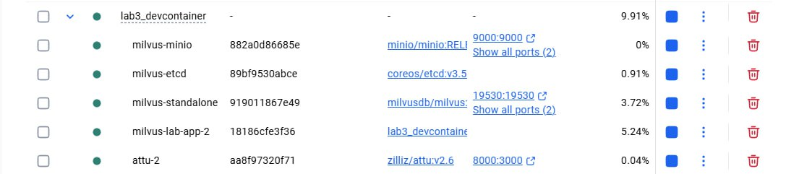
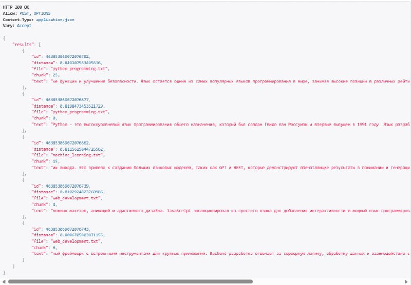
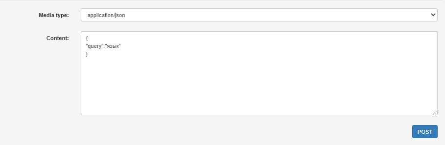
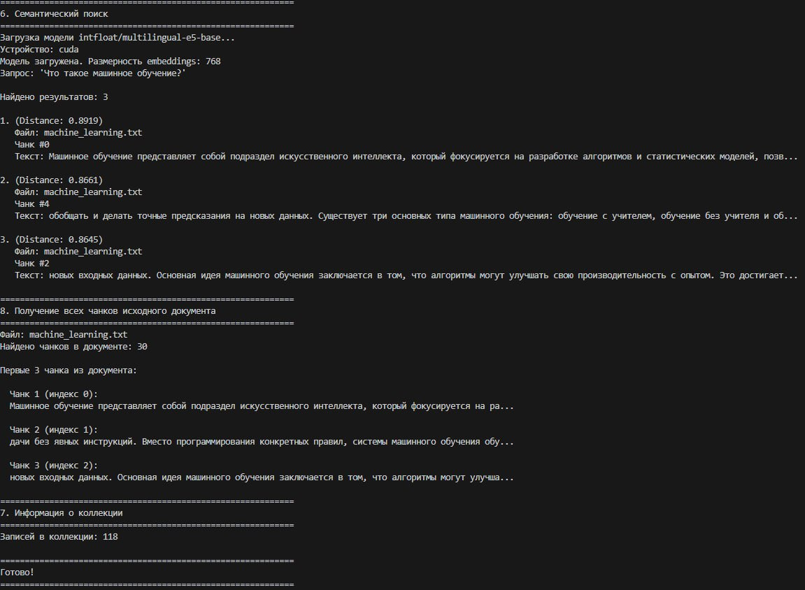

# Лабораторная работа №3. Векторные базы данных и семантический поиск

<ins>Цель</ins>: научиться использовать векторные базы данных и семантический поиск для обработки текстовых данных и потенциальной интеграции с LLM.

## План

1. Настройка окружения;
2. Создание модуля для работы с милвусом;
3. Парсинг текстовых файлов;
4. Задания.

---

## 1. Настройка окружения

В первом шаге в проект был добавлен файла requirements и папка .devcontainer с нужными файлами Dockerfile, devcontainer.json и docker-compose.yml для запуска devcontainer и нужных сервисов, а также дальнейшей работы в изолированной среде. Далее с помощью команды Dev Containers: Rebuild and Reopen in Container была запущена сборка, которая прошла успешно.



## 2. Создание векторной базы данных

Во втором пункте добавляем файл milvus_client.py в котором создаём класс MilvusClient для работы с векторной базой данных Milvus. Здесь по инструкции мы реализуем: подключение к базе, создание коллекции в методе create_collection(), загрузка данных в методе insert_data() и выполнение семантического поиска в методе search().

## 3. Парсинг текстовых файлов

В начале был создан файл text_parser.py в котором прописываются методы для чтение файла, нормализации текста, разбиения его на чанки и сам полный парсинг файла с автоматическим чанкированием. Далее создаём файл document_processor.py в котором реализуем по инструкции класс DocumentProcessor для обработки файлов. Также после ознакомления с всем файлом были добавлены функции для обработки всех файлов в некоторой директории, их чанкирование, генерация embeddings и загрузка в милвус. В файле embedder.py реализуем генерацию векторных представлений текстов. Для этого используется модель multilingual-e5-base. Также после более подробного ознакомления с файлом, была добавлена функция create_embedding_function для использвоания embedder в ранее раелизованном классе DocumentProcessor.

Также был добавлен файл example_usage.py, который реализует сценарий полного использования системы: подключение к Milvus, создание коллекции, обработка текстовых файлов, генерация embeddings и выполнение семантического поиска. В файл milvus_client.py были добавлены дополнительные методы для получения информации о коллекции, удаление коллекции, извлечение всех чанков из конкретного документа, восстановление исходного текста докумената. Также была добавлена папка files для текстовых файлов.

## 4. Задания

В первом задании нужно было запустить описанный выше сценарий с помощью gpu, модифицировав конфиг под использование cuda-зависимостей. Для этого файл docker-compsoe.yml был ненмого изменен.
```
    deploy:
      resources:
        reservations:
          devices:
            - driver: nvidia
              count: all
              capabilities: [gpu]
```



В рамках второго задания достаточно было написать api с единственным контроллером, для получения чанков, названия файла и текстовое содержание файла, в котором содержится запрашиваемя часть текста.





## Код контейнера

```
from django.shortcuts import render
from rest_framework.response import Response
from rest_framework.views import APIView
from rest_framework import status
from .embedder import Embedder
from .milvus_client import MilvusClient


class SearchView(APIView):
    def post(self, request):
        query = request.data.get("query", "")
        if not query:
            return Response({"error": "Query parameter is required."}, status=400)

        try:
            embedder = Embedder()
            query_embedding = embedder.encode_query(query)
        except Exception as e:
            return Response({"error": str(e)}, status=500)

        try:
            collection_name = 'documents'
            milvus = MilvusClient(host="standalone", port=19530)
            search_results = milvus.search(
                collection_name=collection_name,
                query_vectors=[query_embedding],
                top_k=5
            )

            formatted_results = []
            # search_results — список списков (по одному на query vector)
            for i, hit in enumerate(search_results[0], 1):
                formatted_results.append({
                    "id": hit["id"],
                    "distance": hit['distance'],
                    "file": hit.get('file_name', 'N/A'),
                    "chunk": hit.get('chunk_index', -1),
                    "text": hit['text'][:150]
                })

            return Response({"results": formatted_results}, status=status.HTTP_200_OK)

        except Exception as e:
            return Response({"error": str(e)}, status=status.HTTP_500_INTERNAL_SERVER_ERROR)
```

## Вывод

В процессе выполнения лабораторной работы удалось ознакомится с взаимодействем с векторной базой данных milvus. Так же был получен практический опыт настройки docker-контейнера на использованите мощностей видеокарты, путем конфигурации docker-compose файла.
