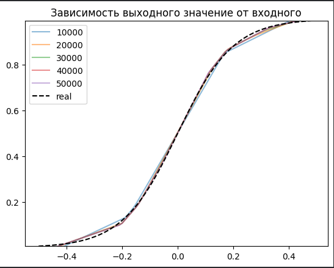
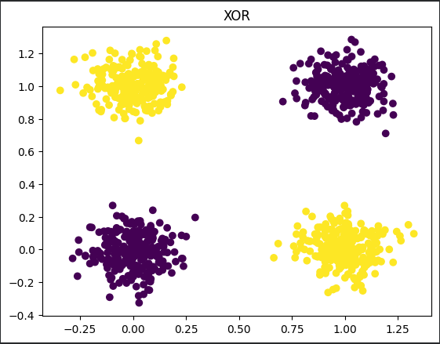
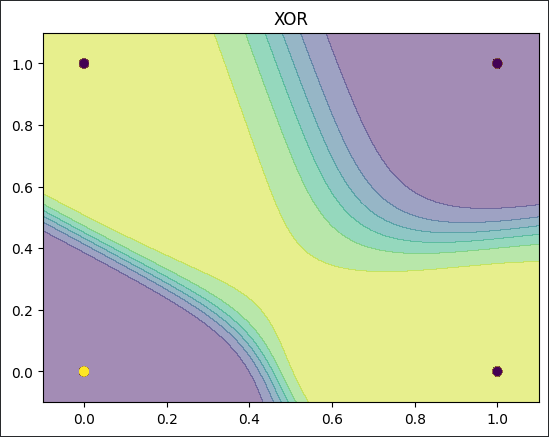
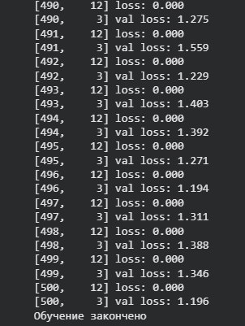
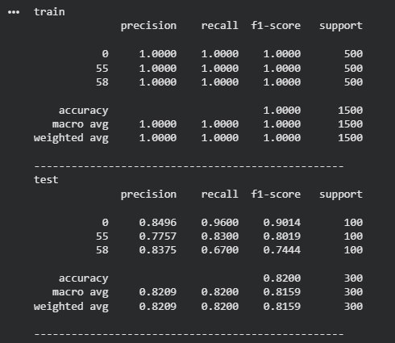

## Технологии программирования. Лабораторная работа №4

## Цель работы

Целью лабораторной работы является изучение основ глубокого обучения и знакомство с фреймворком **PyTorch**. В рамках работы были реализованы и исследованы три задачи:

- регрессия с использованием теоремы универсальной аппроксимации и ручного вычисления градиентов;
- бинарная классификация с применением автодифференцирования в PyTorch;
- классификация изображений из набора данных CIFAR-100 с помощью полносвязной нейронной сети.

### Задание 1

Для выполнения задания 1 необходимо было провести апрроксимацию функции используя средства языка программирования Python и его библиотеки PyTorch. Цель апроксимации функции "угадывание" значения функции в зависимости от входного параметра что является одной из задач обучения нейронных сетей.

На рисунке представлен график зависимости значения вода от выхода. Предположительно функция нам не известна, есть лишь коллекция значений типа "вход-выход". Обучение сети для получения аппроксимации функции заключается в нахождении взаимосвязи этих параметров для продолжения построения графика.

Размерность скрытого слоя была выствлена в 1024, что дало уменьшению дельты между значениеми графиков различного количества эпох.

### Задание 2

Бинарная классификация заключается в определнии различия между двумя объектами.
Для примера решения задач использовалась задача XOR.

Однослойный персептрон не способен решить данную задачу, ввиду своей линейности, в отличии от многослойного персептрона.

Процесс обучения заключается в минимизации функции потерь. Данная задача была выполнена, что подтверждает следующее изображение.

Результат классификации:

### Задание 3

Финальным задание была классификация изображений из выборки CIFAR100.
Результат обучения классификации образов:

Сравнение результатов:

## Вывод

При выполнении лабораторной работы удалось ознакомится с библиотекой PyTorch, позволяющей строить нейронные сети и взаимодействовать с ними. Так же произошло ознакомление с базой данных изображений CIFAR100, которая в отличии от MNIST содержит фотографии в RGB формате.
