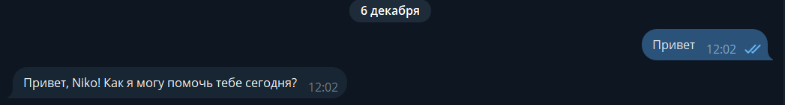
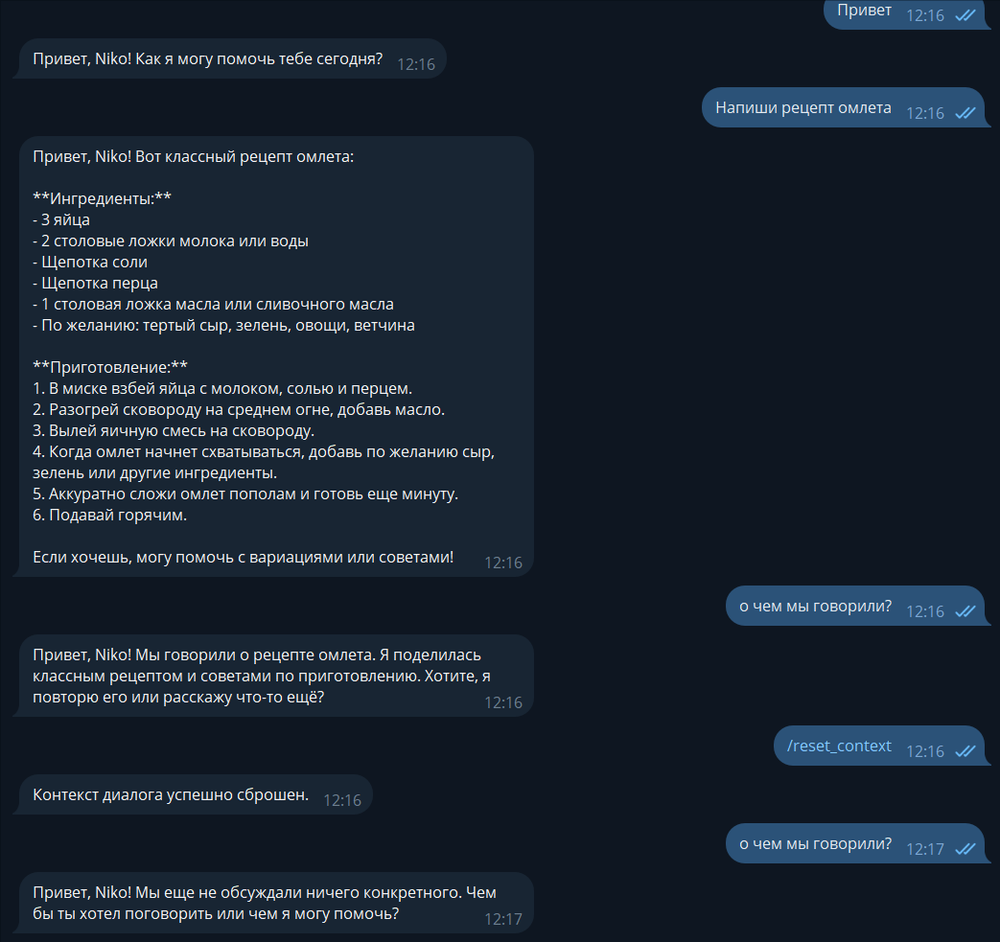
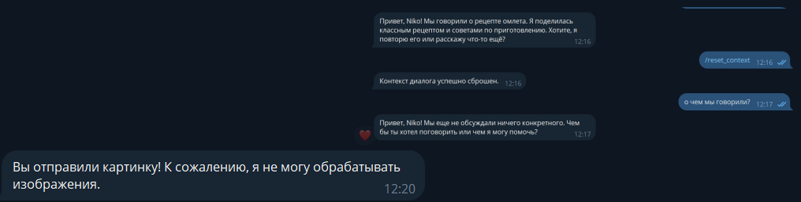

# Лабораторная работа №2: Простейший чат-бот в Telegram

## [Ссылка на бота](https://t.me/lab_2_tg_test_bot)

## Цель работы

Цель лабораторной работы — получение навыков работы с библиотекой Aiogram, связка API OpenAI и написанного бота.

## Инструменты и настройки

- **Язык программирования**: Python.
- **Библиотеки**:
  - `openai` — для работы с API.
  - `dotenv` — для загрузки переменных окружения (например, API-ключ).
  - `aiogram` - для работы с Telegram API, предоставляет удобный асинхронный интерфейс для создания ботов, обработки сообщений, команд и взаимодействия с пользователем.
  

## Реализованные задачи

В коде были реализованы следующие задачи:

1. **Добавление к ассистенту системный промпт**:
    
    ```py
    from config import OPENAI_API_KEY, SYSTEM_PROMPT

    async def get_response(
        message: str, username: str, context_data: str, client: AsyncOpenAI
    ) -> str:
        try:
            personalized_prompt = (
                SYSTEM_PROMPT.format(username=username)
                if "{username}" in SYSTEM_PROMPT
                else f"{SYSTEM_PROMPT} Общайся с пользователем по имени {username}."
            )


            response = await client.responses.create(
                model="gpt-4.1-nano",
                input=full_message,
                instructions=personalized_prompt,
                temperature=0.8,
            )
            return response.output_text
    ```

    Переменная SYSTEM_PROMPT='Ты полезный ассистент. Общайся с пользователем по имени {username}, отвечай на его вопросы.' извлекается из файла .env с помощью os.getenv("SYSTEM_PROMPT"). Системный промпт помогает задавать общий контекст для общения с моделью, например, как она должна вести себя.

    **Результат работы:**

    Бот генерирует ответы, используя системный контекст.

    


2. **Добавление функции обращения к пользователю по имени**:
    Для того чтобы бот знал имя пользователя, используем атрибут message.from_user.full_name
    ```py
    async def message_handler(message: Message) -> None:
    try:
        if message.photo:
            await message.answer(
                "Вы отправили картинку! К сожалению, я не могу обрабатывать изображения."
            )
            return

        username = message.from_user.full_name if message.from_user else "Пользователь"
        user_id = message.from_user.id if message.from_user else 0

        context_data = db_manager.get_user_context(user_id)

        response = await get_response(message.text, username, context_data, client)
    ```
    и передаем в функцию запроса к ChatGPT через системный промт
    ```py
    async def get_response(
        message: str, username: str, context_data: str, client: AsyncOpenAI
    ) -> str:
        try:
            personalized_prompt = (
                SYSTEM_PROMPT.format(username=username)
                if "{username}" in SYSTEM_PROMPT
                else f"{SYSTEM_PROMPT} Общайся с пользователем по имени {username}."
            )


            response = await client.responses.create(
                model="gpt-4.1-nano",
                input=full_message,
                instructions=personalized_prompt,
                temperature=0.8,
            )
            return response.output_text
    ```
    
    

   

3. **Добавление хранения истории сообщений и поддержку контекста диалога**:
    ```py
    class Message(Base):
        __tablename__ = "messages"

        id = Column(Integer, primary_key=True, index=True)
        user_id = Column(Integer, index=True)
        username = Column(String, index=True)
        message_text = Column(Text)
        response_text = Column(Text)
        timestamp = Column(DateTime, default=func.now())

        def __repr__(self):
            return f"<Message(user_id={self.user_id}, username='{self.username}', message='{self.message_text[:50]}...')>"


    class DialogContext(Base):
        __tablename__ = "dialog_contexts"

        id = Column(Integer, primary_key=True, index=True)
        user_id = Column(Integer, unique=True, index=True)
        context_data = Column(Text)
        updated_at = Column(DateTime, default=func.now(), onupdate=func.now())

        def __repr__(self):
            return f"<DialogContext(user_id={self.user_id})>"
    ```
   Для того, чтобы ИИ помнил контекст общения с пользователем, была реализована система ведения истории диалога. Контекст переписки ограничивался 2000 токенами. У каждого пользователя свой сохраненный контекст. 

   Для упрощения задачи и быстрого прототипирования я решил использовать файл SQLite для хранения истории сообщений и подключаться к нему, что позволяет эффективно управлять данными без необходимости использования более сложных баз данных. Это обеспечило простоту реализации и ускорение процесса разработки, что идеально подходит для учебного прототипа.

4. **Добавление команды /resetcontext, которая будет сбрасывать контекст диалога**
    ```py
    @dp.message(Command("reset_context"))
    async def command_reset_context_handler(message: Message) -> None:
        try:
            user_id = message.from_user.id
            db_manager.reset_user_context(user_id)
            await message.answer("Контекст диалога успешно сброшен.")
        except Exception as e:
            logging.error(f"Error occurred: {e}")
            await message.answer("Произошла ошибка при сбросе контекста диалога.")
    ```
    ```py
    def reset_user_context(self, user_id: int) -> bool:
        """Сбросить контекст диалога пользователя"""
        session = self.get_session()
        try:
            context = (
                session.query(DialogContext)
                .filter(DialogContext.user_id == user_id)
                .first()
            )
            if context:
                session.delete(context)
                session.commit()
            return True
        except SQLAlchemyError as e:
            logging.error(f"Error resetting user context: {e}")
            session.rollback()
            return False
        finally:
            session.close()
    ```
    Для реализации команды `/reset_context`, которая сбрасывает контекст диалога, я создал обработчик для этой команды, который проверяет, есть ли сохраненная история для конкретного пользователя, используя его уникальный `user_id`. Когда пользователь отправляет команду `/resetcontext`, я извлекаю его user_id из сообщения с помощью `message.from_user.id`. Затем, проверяя, существует ли история диалога этого `user_id` в таблице, я удаляю соответствующую запись в таблице. После этого отправляется сообщение, подтверждающее, что история была сброшена и можно начать новый разговор.

    


4. **Добавление поддержки отправки изображений (без их обработки нейронкой).**
    ```py
    @dp.message()
    async def message_handler(message: Message) -> None:
        try:
            if message.photo:
                await message.answer(
                    "Вы отправили картинку! К сожалению, я не могу обрабатывать изображения."
                )
                return
    ```

    Для обработки сообщений, отличных от текста (например, изображений, видео и других медиа), я добавил проверку типа сообщения с помощью `message.photo`,которое проверяет, является ли отперавленое сообщение фотографией. Если да, то вывожу пользователю сообщение о том, что бот не работает с фото.


    


## Вывод

В ходе лабораторной работы был создан Telegram-бот с использованием библиотеки `Aiogram` и интеграцией с `API OpenAI`. Бот поддерживает системный промпт для задания контекста общения, обращается к пользователю по имени и запоминает историю диалогов с помощью базы данных. Реализована команда `/reset_context` для сброса истории, а также обработка различных типов медиа. В результате работы были получены навыки работы с асинхронным программированием, Telegram API и хранением данных, а также реализована поддержка контекста и взаимодействие с пользователем на более персонализированном уровне.