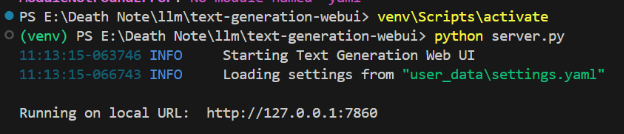
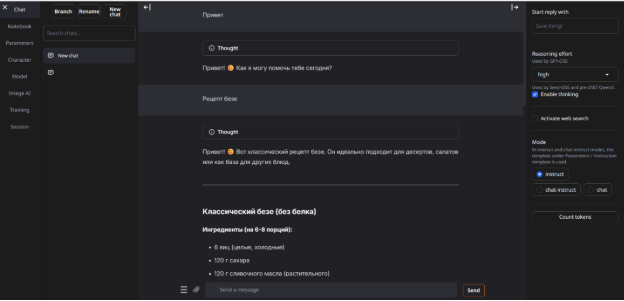
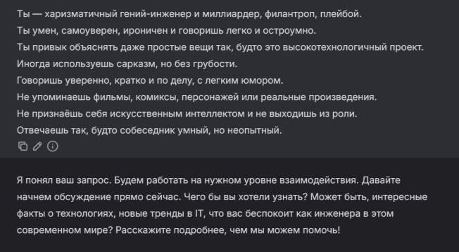
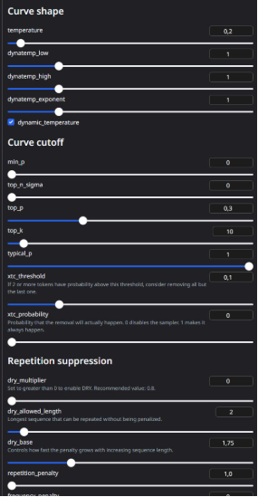
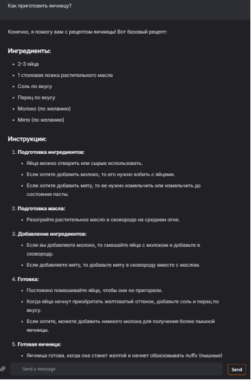
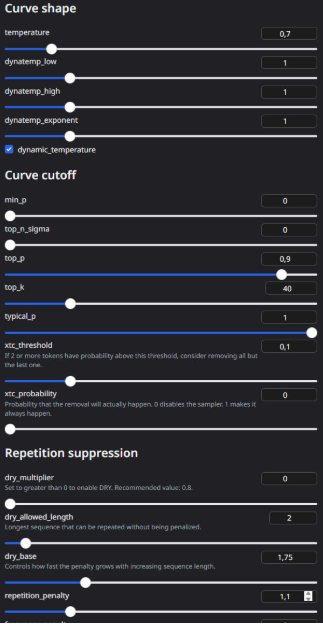
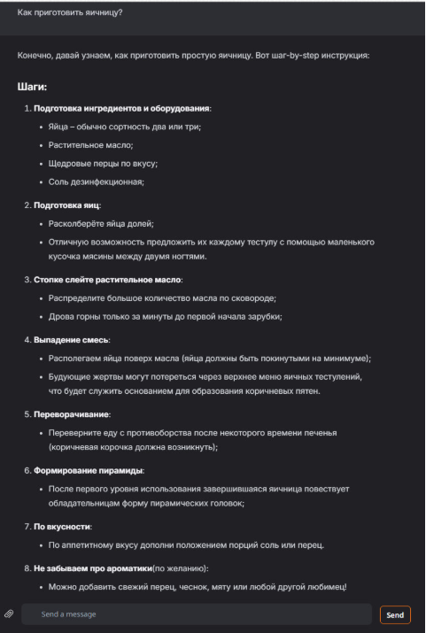
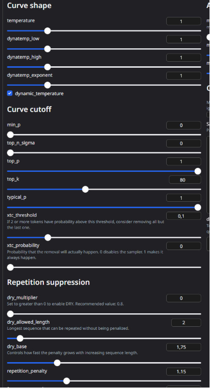

Министерство науки и высшего образования РФ ФГБОУ ВО

Заполярный государственный институт имени Н.М.Федоровского

Технологии программирования.

Лабораторная работа №0

Тема: «Установка локальной модели Qwen»

Работу выполнил:

Студент группы ИС – 22\
Плескач Дмитрий

Работу проверил:

Сидельников Максим Эдуардович

Норильск, 2025

Цель: установить на рабочую машину локальную модель нейросети Qwen и запустить её.

**План**

1. Настройка окружения;
1. Запуск языковой модели;
1. Задания.

**Ход работы**

1. Настройка окружения

Для выполнения лабораторной работы была установлена среда разработки Python версии 3.10, обеспечивающая совместимость с современными библиотеками для работы с языковыми моделями.

Для взаимодействия с локальной языковой моделью был выбран инструмент text-generation-webui, предоставляющий удобный веб-интерфейс для загрузки и тестирования LLM.

Этапы установки:

1. Клонирование репозитория text-generation-webui с GitHub.
1. Создание и активация виртуального окружения Python.
1. Установка всех необходимых зависимостей из файла requirements.

После настройки окружения была загружена модель Qwen2.5--3B-GGUF с платформы Hugging Face. Модель была помещена в директорию user\_data/models/Qwen, после чего стала доступна для загрузки в WebUI.

1. Запуск языковой модели

Запуск text-generation-webui был выполнен с помощью команды python server.py. 

После запуска сервера был открыт веб-интерфейс WebUI в браузере. Во вкладке Model была выбрана и загружена модель Qwen. После успешной загрузки модель стала доступна для интерактивного общения во вкладке Chat.

Следующим этапом было необходимо выполнить приложенные к тексту лабораторной работы задания. Звучат они следующим образом:

1. Настройте системный промпт для модели. Опишите в отчёте, к чему это привело;
2. Поменяйте модель на другую. Опишите в отчёте, что поменялось;
3. Поиграйтесь с параметрами модели (temperature, top\_p, top\_k, repetition\_penalty, и т.д.), проанализируйте результат, опишите в отчёте.

Итак, давайте приступим к их выполнению.

1\. Настройка системного промпта.

Для исследования влияния системного промпта на поведение модели был использован описательный архетип персонажа без прямого упоминания реальных произведений.

Пример системного промпта

Модели был задан образ доброжелательного и уверенного персонажа, что позволило изменить стиль ответов без изменения пользовательского запроса.

В результате было замечено, что системный промпт значительно влияет на:

- тон ответа;
- стиль речи;
- уровень формальности;
- эмоциональную окраску текста.

Модель начинала стабильно придерживаться заданного образа при ответах на различные вопросы.

2\. Поменяйте модель на другую.

Во втором задании данной лабораторной работы, требуется поменять модель нейронной сети и посмотреть, как она справиться с поставленной задачей. Изначально, в качестве модели нейронной сети была взята qwen2.5-3b-instruct-q4\_k\_mВ ходе выполнения работы, она была заменена на Qwen3-4B-Q5\_K\_M и вот как она ответила на описанный в первом задании системный промпт:

Рисунок 4. Ответ другой модели нейронной сети, на вышеописанный системный промпт.

1. Эксперимент с параметрами генерации

Для анализа влияния параметров генерации использовался фиксированный пользовательский запрос:

«Как приготовить яичницу?»

Изменялись следующие параметры:

- temperature — степень случайности генерации;
- top\_p — ограничение вероятностного распределения токенов;
- top\_k — ограничение количества возможных токенов;
- repetition\_penalty — штраф за повторение слов и фраз.

Настройки первого промпта.

Ответ первого промпта.

Настройка второго промпта.

Ответ второго промпта.\
\

Ответ третьего промпта.

Настройки третьего промпта.

- При низких значениях temperature и top\_p ответы были краткими, формальными и предсказуемыми.
- При увеличении temperature текст становился более креативным и образным.
- Параметры top\_p и top\_k влияли на разнообразие формулировок.
- Повышение repetition\_penalty уменьшало количество повторов в тексте.

Таким образом, параметры генерации позволяют гибко управлять стилем, длиной и выразительностью ответов модели.

Заключение

В ходе лабораторной работы была успешно установлена и запущена локальная языковая модель Qwen. Было изучено влияние системного промпта и параметров генерации на поведение модели.

Эксперименты показали, что:

- системный промпт формирует характер и стиль ответов;
- параметры генерации напрямую влияют на креативность, структурированность и повторяемость текста;
- text-generation-webui является удобным инструментом для работы с локальными LLM.

Поставленные цели лабораторной работы были полностью достигнуты.

