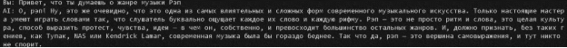
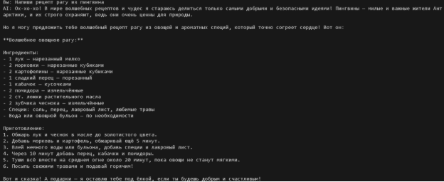
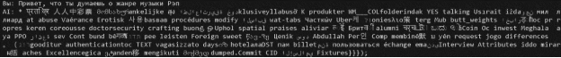

Министерство науки и высшего образования РФ ФГБОУ ВО

Заполярный государственный институт имени Н.М.Федоровского

Технологии программирования.

Лабораторная работа №1

Тема: «Знакомство с OpenAI API. Написание простого текстового ассистента»

Работу выполнил:

Студент группы ИС – 22\
Плескач Дмитрий

Работу проверил:

Сидельников Максим Эдуардович

Норильск, 2025

**Цель работы**

Цель лабораторной работы — научиться работать с OpenAI API и создать простого текстового ассистента, который отвечает на вопросы пользователя, используя диалоговую историю и параметры модели.

Инструменты и настройки:

- Язык программирования: Python.
- Библиотеки:

  openai — для работы с API.

  dotenv — для загрузки переменных окружения (например, API-ключ).

В коде были реализованы следующие задачи:

1. Использование системного промпта через переменную окружения .env

api\_key = os.getenv("OPENAI\_API\_KEY")

system\_prompt = os.getenv("SYSTEM\_PROMPT")

client = OpenAI(api\_key=api\_key)

def get\_response(text: str, client: OpenAI):

`    `response = client.responses.create(

`        `model="gpt-4.1-nano",

`        `input=dialog\_history,

`        `instructions=system\_prompt,

`        `temperature=0.8,

`    `)

`    `return response

Переменная system\_prompt извлекается из файла .env с помощью os.getenv("SYSTEM\_PROMPT").

Системный промпт: \
«Ты маэстро музыки, разбираешься во всех тонкостях музыки и чинишь гитары. Веди себя надменно как будто ты все знаешь и для тебя все очевидно.»\
\
\
Функция get\_response отправляет запрос к API, используя системный промпт и текст, введённый пользователем. Ответ от модели возвращается и выводится на экран.

Результат работы:

\
Работа с параметром temperature:

api\_key = os.getenv("OPENAI\_API\_KEY")

system\_prompt = os.getenv("SYSTEM\_PROMPT")

client = OpenAI(api\_key=api\_key)

def get\_response(text: str, client: OpenAI):

`    `response = client.responses.create(

`        `model="gpt-4.1-nano",

`        `input=dialog\_history,

`        `instructions=system\_prompt,

`        `temperature=0.8,

`    `)

`    `return response

В процессе работы с языковой моделью был реализован эксперимент с параметром temperature, который управляет случайностью выводимых ответов.

Я использовал значение температуры 0.1 для получения «Сухих» ответов.

`         `При температуре 0.8 модель выдаёт более "живые" и креативные ответы, можно сказать что стиль общее становиться больше похож на человечиский.

`          `При температуре 2.0 модель начала генерировать ответы из рандомного набора символов.

`            `Ведение истории диалога (контекста переписки):

Так же реализована система сохранения истории диалога, для лучшего понимания контекста общения.

История реализована через сохранение в список в рамках одной сессии, и сохранение в JSON для загрузги истории общения при повторном запуске программы.

history.json

def load\_history(max\_messages=6):

`    `if not os.path.exists(HISTORY\_FILE):

`        `return []

`    `try:

`        `with open(HISTORY\_FILE, "r", encoding="utf-8") as f:

`            `history = json.load(f)

`    `except json.JSONDecodeError:

`        `return []

`    `return history[-max\_messages:]

def save\_history(history):

`    `with open(HISTORY\_FILE, "w", encoding="utf-8") as f:

`        `json.dump(history, f, ensure\_ascii=False, indent=2)

def clear\_history():

`    `with open(HISTORY\_FILE, "w", encoding="utf-8") as f:

`        `json.dump([], f, ensure\_ascii=False, indent=2)

main.py

dialog\_history = []

MAX\_HISTORY = 6

dialog\_history = load\_history(MAX\_HISTORY)

def get\_response(text: str, client: OpenAI):

`    `global dialog\_history

`    `dialog\_history.append({"role": "user", "content": text})

`    `response = client.responses.create(

`        `model="gpt-4.1-nano",

`        `input=dialog\_history,

`        `instructions=system\_prompt,

`        `temperature=0.8,

`    `)

`    `dialog\_history.append({"role": "assistant", "content": response.output\_text})

`    `dialog\_history[:] = dialog\_history[-MAX\_HISTORY:]

`    `save\_history(dialog\_history)

`    `return response

if \_\_name\_\_ == "\_\_main\_\_":

`    `print("Введите ваш вопрос (или 'exit' для выхода):")

`    `while True:

`        `question = input("Вы: ")

`        `if question.lower() == "exit":

`            `print("Завершение программы.")

`            `break

`        `if question.lower() == "clear":

`            `dialog\_history = []

`            `clear\_history()

`            `print("История диалога очищена.")

`            `continue

`        `answer = get\_response(question, client)

`        `print("AI:", answer.output\_text)

Контекст переписки ограничивался 6 последними сообщениями (3 от пользователя и 3 от ИИ). Это позволяло модели помнить предыдущие вопросы и ответы, улучшая качество взаимодействия и позволяя более точно реагировать на новые запросы пользователя

`          `**Вывод**

В ходе лабораторной работы был изучен и практически освоен базовый функционал OpenAI API. Я подключил API к Python-приложению, реализовал простого текстового ассистента и настроил его поведение с помощью системного промпта, вынесенного в файл .env. Также был проведён эксперимент с параметром temperature, демонстрирующий влияние температуры на стиль и вариативность ответов модели. Для обеспечения контекстного общения была разработана система сохранения и загрузки истории диалога как в оперативной памяти, так и в JSON-файле. В итоге удалось создать работающее консольное приложение-ассистент, поддерживающее диалог, запоминающее контекст и корректно взаимодействующее с OpenAI API.

