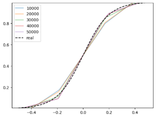
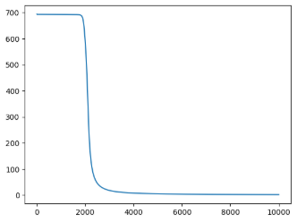
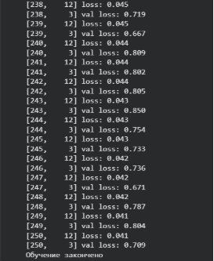
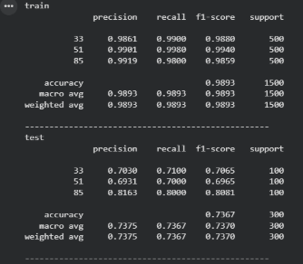
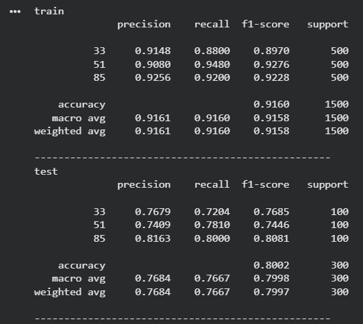

**ОТЧЁТ**

**по лабораторной работе №1**

**«Введение в DL»**

**Дисциплина:** Технологии программирования\
**Студент:** Плескач Дмитрий Михайлович\
**Группа:** ИС-22\
**Преподаватель:** Сидельников М.Э.\
**Год:** 2025

**Цель работы**

Целью лабораторной работы является знакомство с фреймворком PyTorch и основными принципами построения и обучения нейронных сетей. В ходе работы необходимо реализовать задачи регрессии, бинарной классификации и классификации изображений, а также проанализировать влияние гиперпараметров и архитектуры модели на качество обучения.

**Задание**

1. Реализовать регрессию по теореме универсальной аппроксимации с ручным дифференцированием
1. Реализовать бинарную классификацию с использованием автоматического дифференцирования PyTorch
1. Обучить полносвязную нейронную сеть для классификации 3 классов изображений CIFAR-100 и повысить точность модели

**Задание №1. Регрессия и ручное дифференцирование**

Теорема универсальной аппроксимации утверждает, что нейронная сеть с одним скрытым слоем и достаточным количеством нейронов способна аппроксимировать любую непрерывную функцию с заданной точностью. В рамках данного задания была решена задача регрессии — предсказания непрерывного значения функции.

Для обучения использовалась полносвязная нейронная сеть с одним скрытым слоем и функцией активации ReLU. В качестве функции потерь применялась среднеквадратичная ошибка (MSE). Градиенты по весам сети вычислялись вручную с использованием правила цепочки, без применения механизма автоматического дифференцирования.

На первом этапе были сгенерированы входные данные и целевая функция с добавлением шума.

После этого была реализована процедура обучения нейронной сети методом градиентного спуска. В процессе обучения наблюдалось постепенное уменьшение ошибки и приближение предсказаний модели к целевой функции.

Таким образом, было подтверждено, что нейронная сеть способна успешно аппроксимировать заданную функцию, что соответствует теореме универсальной аппроксимации.

**Задание №2. Бинарная классификация с автодифференцированием**

Во второй части лабораторной работы была решена задача бинарной классификации. Для примера использовалась искусственно сгенерированная выборка, представляющая собой линейно неразделимую задачу.

Для обучения была построена полносвязная нейронная сеть. В отличие от первой части, вычисление градиентов выполнялось автоматически с использованием механизма autograd, встроенного в PyTorch. В качестве функции потерь использовалась бинарная кросс-энтропия.

В процессе обучения значение функции потерь быстро уменьшалось, что свидетельствует о корректной настройке модели и оптимизатора.

После завершения обучения была визуализирована граница принятия решений, которая корректно разделила объекты двух классов.

Таким образом, модель успешно решила задачу бинарной классификации.

**Задание №3. Классификация изображений CIFAR-100**

В третьей части лабораторной работы решалась задача классификации изображений из набора данных CIFAR-100. Датасет содержит 60 000 цветных изображений размером 32×32 пикселя, распределённых по 100 классам.

Для обучения были выбраны три класса по варианту:

- 33
- 51
- 85

Изображения были нормализованы по каналам RGB. Для обучения использовалась полносвязная нейронная сеть (MLP).

**Базовая модель**

Базовая модель представляла собой MLP с одним скрытым слоем и функцией активации ReLU. Обучение проводилось с использованием оптимизатора SGD и функции потерь CrossEntropyLoss.

После обучения была получена следующая оценка качества модели на обучающей и тестовой выборках.

**Изменение модели**

Были изменены параметры обучения - увеличено количество нейронов в скрытых слоях и увеличено количество эпох. \
EPOCHS = 1000\
HIDDEN\_SIZE = 1024\
В результате данных изменений удалось повысить точность модели на тренировочной выборке, но результаты тестовой почти не изменились. Можно сделать вывод что модель переобучилась. \

Чтобы снизить переобучение были изменены параметры обучения. Была уменьшена скорость обучения, увеличен размер батча, а также добавлен дополнительный скрытый слой в нейронной сети. Выбрано более подходящее количество эпох обучения на основе результатов на тестовой выборке. В результате данных изменений точность на тестовой выборке увеличилась.

**Вывод**

В ходе выполнения лабораторной работы были изучены основные принципы работы нейронных сетей и фреймворка PyTorch. Были реализованы задачи регрессии, бинарной классификации и классификации изображений. Проведён анализ влияния гиперпараметров и архитектуры модели на качество обучения. Полученные результаты подтвердили эффективность методов глубокого обучения для решения поставленных задач.

**Ссылка на Google Colab**

https://colab.research.google.com/drive/1bmv3pF9fKIOH\_K2Nf6KM8mUnk5aXabOd?usp=sharing
